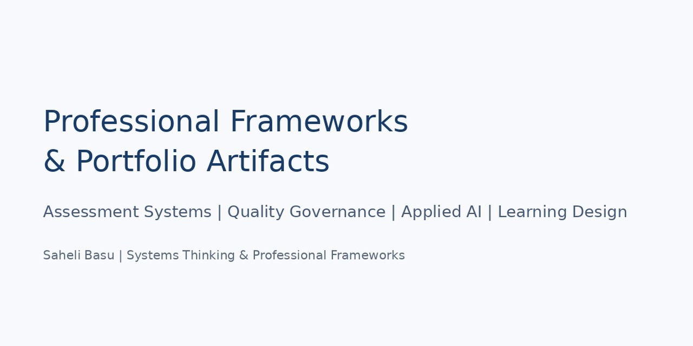

# Saheli Basu | Professional Portfolio Artifacts

  

## Professional Frameworks & Portfolio Artifacts

**Assessment Systems** | **Quality Governance** | **Applied AI** | **Learning Design**

A collection of systems-oriented frameworks, evaluation models, and learning design artifacts demonstrating structured approaches to professional capability building.

---

## About This Portfolio

A collection of professional frameworks, systems approaches, and learning design artifacts focused on:

- Learning & Assessment Systems
- Instructional Design
- Quality Governance
- Applied AI Evaluation
- Knowledge Management

These artifacts demonstrate approaches for transforming expertise into structured frameworks, practical workflows, and scalable professional learning systems.

---

## Featured Artifacts

## 1. Quality Governance Framework for Scalable Operations

A governance-led approach for improving quality visibility, accountability, workflow traceability, and continuous improvement.

**Focus:**
Quality Governance | Process Improvement | Operational Excellence

- 🚀 [View Artifact](./01-quality-governance-framework/)
- 📄 [View PDF](./01-quality-governance-framework/quality-governance-framework.pdf)
- 💼 [Request Service on Contra](https://contra.com/s/bAYgPrg2-quality-governance-and-process-improvement-frameworks)
- 🔗 [Request Service on LinkedIn](https://www.linkedin.com/services/page/36843430b418961488/)

---

## 2. Designing Competency-Based Assessment Systems

A framework for translating professional competencies into measurable assessment systems.

**Focus:**
Assessment Design | Competency Frameworks | Learning Measurement

- 🚀 [View Artifact](./02-competency-based-assessment-systems/)
- 📄 [View PDF](./02-competency-based-assessment-systems/competency-assessment-system.pdf)
- 💼 [Request Service on Contra](https://contra.com/s/cY37UMFo-assessment-system-design-and-quality-frameworks)
- 🔗 [Request Service on LinkedIn](https://www.linkedin.com/services/page/36843430b418961488/)

---

## 3. Designing Professional Learning Experiences

An instructional design approach connecting learning objectives, activities, assessment, and workplace application.

**Focus:**
Instructional Design | Curriculum Architecture | Learning Experience Design

- 🚀 [View Artifact](./03-professional-learning-experiences/)
- 📄 [View PDF](./03-professional-learning-experiences/learning-experience-design.pdf)
- 💼 [Request Service on Contra](https://contra.com/s/oAeqE2ZO-learning-experience-design-and-curriculum-architecture)
- 🔗 [Request Service on LinkedIn](https://www.linkedin.com/services/page/36843430b418961488/)

---

## 4. AI-Assisted Learning Workflow Evaluation

An evaluation framework for responsible adoption of AI-supported learning workflows.

**Focus:**
Responsible AI | Human-in-the-Loop Design | Learning Technology

- 🚀 [View Artifact](./04-ai-assisted-learning-workflow-evaluation/)
- 📄 [View PDF](./04-ai-assisted-learning-workflow-evaluation/ai-learning-workflow-evaluation.pdf)
- 💼 [Request Service on Contra](https://contra.com/s/ROWc7Y3B-ai-workflow-evaluation-and-human-in-the-loop-design)
- 🔗 [Request Service on LinkedIn](https://www.linkedin.com/services/page/36843430b418961488/)

---

## 5. SysteMetic: Professional Learning & Knowledge Systems Initiative

An independent initiative exploring how expertise can become structured learning resources, frameworks, and capability-building systems.

**Focus:**
Knowledge Management | Professional Publishing | Systems Thinking

- 🚀 [View Artifact](./05-systemetic-learning-knowledge-systems/)
- 📄 [View PDF](./05-systemetic-learning-knowledge-systems/systemetic-framework.pdf)
- 💼 [Request Service on Contra](https://contra.com/saheli_basu_ii72r1bo/services?r=saheli_basu_ii72r1bo)
- 🔗 [Request Service on LinkedIn](https://www.linkedin.com/services/page/36843430b418961488/)

---

## Connect With Me

- 🌐 Portfolio Website: [Visit Portfolio](https://sahelibasu23.github.io)
- 💼 LinkedIn Profile: [Visit LinkedIn Profile](https://www.linkedin.com/in/saheli-basu/)
- 🚀 LinkedIn Services: [View LinkedIn Services Page](https://www.linkedin.com/services/page/36843430b418961488)
- ✨ Contra Profile: [Visit Contra Profile](https://contra.com/saheli_basu_ii72r1bo/work?r=saheli_basu_ii72r1bo)
- 🛠️ Contra Services: [View Contra Services](https://contra.com/saheli_basu_ii72r1bo/services?r=saheli_basu_ii72r1bo)

---

**Created by Saheli Basu**

Learning & Assessment Systems | Instructional Design | Quality Governance | Applied AI Evaluation
